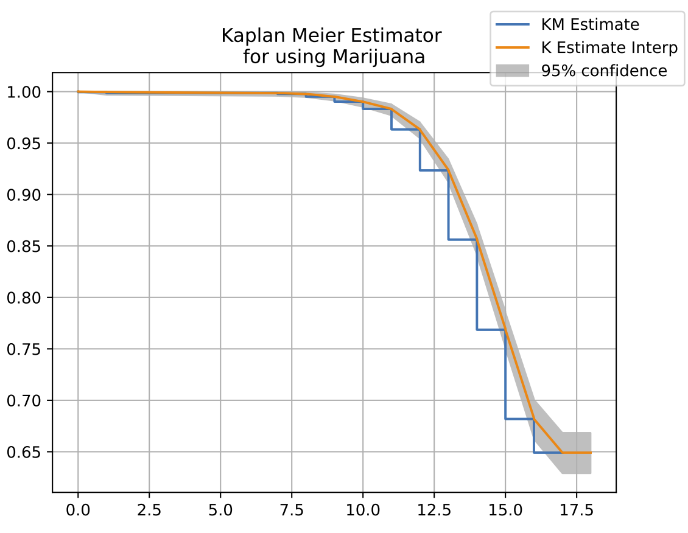
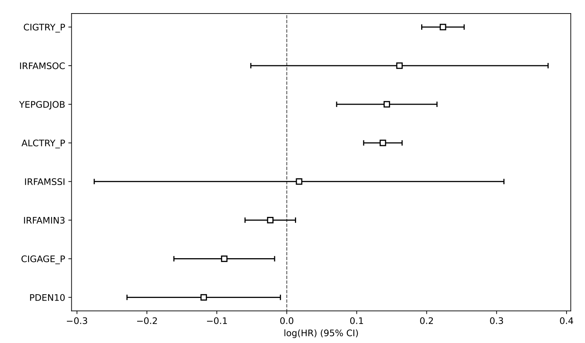

# 🌱 Surviving the Teenage Years Without Smoking Marijuana

This project explores the factors influencing the age of first marijuana use among teenagers using **survival analysis** techniques. Leveraging data from the 📊 **National Survey on Drug Use and Health (NSDUH)**, we model the risk of marijuana initiation through classical statistical methods and modern machine learning approaches.

## 📂 Project Files

- 📄 [Full Report (PDF)](Report_Surviving_the_teenage_years_without_smoking_marijuana.pdf) — Detailed explanation of methods, results, and discussion.
- 📓 [Jupyter Notebook](Notebook_teen-marijuana-survival-analysis.ipynb) — Full implementation of the analysis in Python.

## 🔍 Highlights
- 📉 **Kaplan-Meier Estimation** for modeling survival probability of non-use
- 📈 **Cox Proportional Hazards Model** to quantify risk factors (e.g. early alcohol/cigarette use, income, social security)
- 🧠 **Model Evaluation** with AIC, Concordance Index, Accuracy, F1-score, and more
- 🤖 **Machine Learning Models**:
  - 🌲 Random Survival Forest
  - ⚡ XGBSE (XGBoost for Survival Analysis)

## 📷 Preview

### Kaplan-Meier Estimator
Illustrates survival probability of not smoking marijuana up to age 17:

### Feature Importance from Cox Model
Shows which covariates increase or decrease risk:

## 📌 Key Insight
Teens who try alcohol or cigarettes at a younger age are at significantly higher risk of early marijuana use. Socioeconomic status and parental support also play crucial roles.
